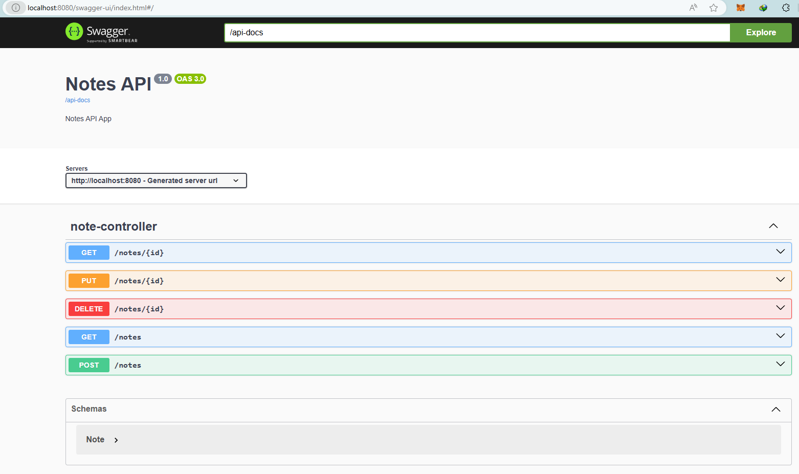

# Notes API
OTA code challenge

## Description
A simple RESTful API for managing notes, built with Java 17 and Spring Boot.

## Endpoints

- `POST /notes`: Create a new note.
- `GET /notes`: Retrieve all notes.
- `GET /notes/{id}`: Retrieve a specific note by ID.
- `PUT /notes/{id}`: Update a specific note by ID.
- `DELETE /notes/{id}`: Delete a specific note by ID.

## Setup

1. Clone the repository:
    ```sh
    git clone <repository-url>
    cd notesapi
    ```

2. Build the project:
    ```sh
    mvn clean install
    ```

3. Run the application:
    ```sh
    mvn spring-boot:run
    ```

4. The API will be available at `http://localhost:8080`.

## Usage

You can use tools like Postman or cURL to interact with the API. Swagger can also be used for interactive API documentation and testing. Detailed steps to use Swagger are provided below.

### Sample Payloads

- **Create a Note (POST /notes)**

    Request:
    ```sh
    curl -X POST http://localhost:8080/notes -H "Content-Type: application/json" -d '{
        "title": "Sample Note",
        "content": "This is a sample note."
    }'
    ```

    Payload:
    ```json
    {
        "title": "Sample Note",
        "content": "This is a sample note."
    }
    ```

- **Get All Notes (GET /notes)**

    Request:
    ```sh
    curl -X GET http://localhost:8080/notes
    ```

- **Get a Note by ID (GET /notes/{id})**

    Request:
    ```sh
    curl -X GET http://localhost:8080/notes/1
    ```

- **Update a Note (PUT /notes/{id})**

    Request:
    ```sh
    curl -X PUT http://localhost:8080/notes/1 -H "Content-Type: application/json" -d '{
        "title": "Updated Note",
        "content": "This is an updated note."
    }'
    ```

    Payload:
    ```json
    {
        "title": "Updated Note",
        "content": "This is an updated note."
    }
    ```

- **Delete a Note (DELETE /notes/{id})**

    Request:
    ```sh
    curl -X DELETE http://localhost:8080/notes/1
    ```

### Error Handling

- **Validation Errors**

    Example Response:
    ```json
    {
        "title": "Title is required",
        "content": "Content is required"
    }
    ```

- **Note Not Found**

    Example Response:
    ```json
    {
        "timestamp": "2024-07-18T12:34:56.789+00:00",
        "status": 404,
        "error": "Not Found",
        "path": "/notes/99"
    }
    ```

## Assumptions

- The ID of a note is automatically generated and managed by the application.
- The application uses an in-memory data store, so all notes will be lost when the application is restarted.

## OpenAPI (Swagger)
This application includes OpenAPI (Swagger) for API documentation and testing.

1. **Access the Swagger UI**

   Once the application is running, open your web browser and go to: http://localhost:8080/swagger-ui/

   
2. **Explore the API Endpoints**

The Swagger UI provides a web interface to explore and test the API endpoints.
You can see the available endpoints, their methods, and the required/request bodies.
Requests can also be made directly from the Swagger UI.

Here is a screenshot of the Swagger UI for notes API:

